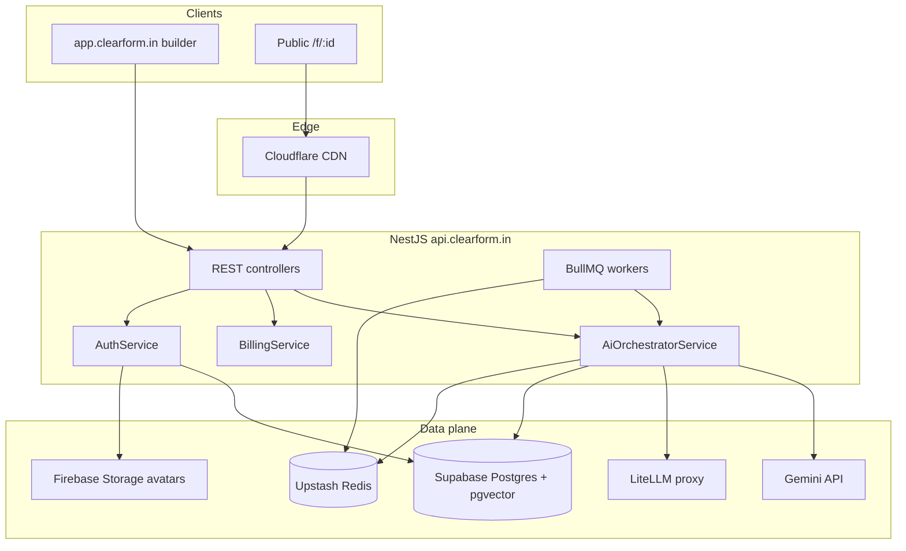
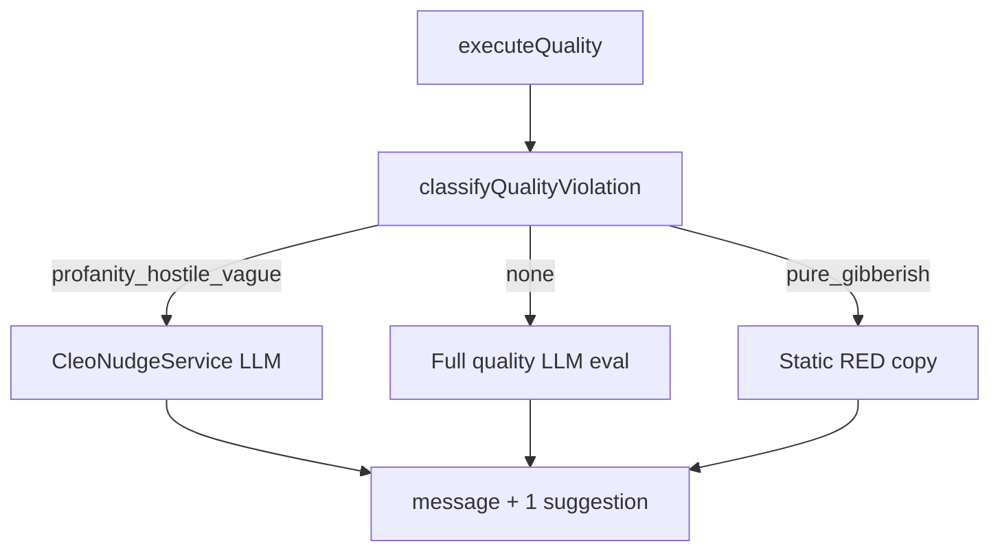

# Clearform backend system flow

**Audience:** Backend / infra engineers  
**Last updated:** 2026-06-28

Single reference for AI harness, billing, profile storage, caches, and queues. Runtime doctrine lives in [`src/ai/doctrine/`](../../src/ai/doctrine/) — see [`src/ai/SKILL.md`](../../src/ai/SKILL.md).

---

## 1. Architecture

---

## 2. AI response quality flow

### Live eval (keystroke)

`POST /api/v1/forms/:formId/response-quality/evaluate`

1. Redis dedup `ai:quality:eval:{formId}:{hash}` (30s)
2. **Violation classifier** (priority order): profanity (O-5) → hostile (O-6) → injection → gibberish (O-1) → too short (O-3) → low value (O-4) → off-topic (O-2)
3. **pure_gibberish** → static RED (no LLM)
4. **Single doctrine LLM eval** — violation classifier adds a signal block to the user prompt; system prompt includes `signals/*.md`, `response-quality-nudges.md`, and `respondent-conduct.md` (no separate Cleo nudge service on the hot path)
5. **Clean answers** → full eval LLM with `getDoctrineSlim('response-quality')` + form context + pgvector memory (3 chunks)
6. False-green guard re-classifies before returning green
7. Grounding validator → store green/amber chunks to `form_memory_chunks`

Key files: `src/ai/ai-orchestrator.service.ts`, `src/ai/ai-quality-rules.util.ts`, `src/ai/cleo/cleo-nudge.service.ts`, `src/ai/profanity-lists.ts`

Doctrine: `src/ai/doctrine/tasks/response-quality-nudges.md`, `src/ai/doctrine/policies/respondent-conduct.md`

### Post-submit (async)

`POST /forms/:id/responses` → Bull `responses` → Bull `ai-quality` → same `executeQuality()` per screen (includes `qualityOptions` from snapshot).

### Cleo learning (nightly)

Builder `aiFeedback` (rating -1) → Bull `cleo-learning` → distill rules → pgvector `quality_feedback`.

### Degradation ladder

See [`doctrine/scale.md`](./doctrine/scale.md):

| Step | Status |
|------|--------|
| Gemini-first for `GEMINI_TASKS` (default `fast`) | Implemented (2026-07-02) |
| Gemini fail → LiteLLM → OpenRouter fallback | Implemented |
| LLM fail → rule heuristics | Implemented |
| Memory retrieval fail → snapshot-only | Implemented (try/catch around RAG) |
| Insights &lt; 10 responses → no LLM | Implemented |

**Gemini provider (2026-07-02):** `GeminiGatewayService` (`src/ai/gemini-gateway.service.ts`)
calls the Gemini Developer API (OpenAI-compatible endpoint) with `GEMINI_API_KEY`,
billed to the upgraded Firebase pay-as-you-go project. Models: pro →
`gemini-2.5-flash`, free → `gemini-2.5-flash-lite` (override via `GEMINI_MODEL_PRO`
/ `GEMINI_MODEL_FREE`). Only tasks listed in `GEMINI_TASKS` go Gemini-first; set
`GEMINI_TASKS=fast,insights,logic` to move insights + logic over once the quality
path has been observed. Embeddings stay on the existing provider (pgvector is
sized `vector(1536)`).

**Observability:** every resolved LLM attempt writes a fire-and-forget row to
`ai_call_logs` (provider, model, task, tier, formId, latencyMs, tokens, success).
Cost/latency check: `SELECT provider, model, count(*), avg("latencyMs"), sum("promptTokens"), sum("outputTokens") FROM ai_call_logs GROUP BY 1, 2;`

---

## 3. Billing / Pilot flow

`GET /api/v1/billing/status` returns plan limits, usage, receipt, and **plan metadata**:

| Field | Purpose |
|-------|---------|
| `planName` | Display name ("Free" / "Clearform Pilot") |
| `aiTier` | `free` \| `pro` (mirrors `AiTierService`) |
| `periodLabel` | "90-day pilot" or cumulative free-tier note |
| `features[]` | Included features for Usage & Billing UI |

Checkout: `POST /billing/checkout-sessions/pilot` → Razorpay Orders → webhook / `claim-purchase`.

Source of truth: `src/config/plans.ts`, `src/config/plan-features.ts`.

Ops: [`billing-setup.md`](../billing-setup.md), [`landing-billing-handoff.md`](../landing-billing-handoff.md).

---

## 4. Profile avatar flow

1. `POST /api/v1/auth/me/avatar` — multipart `file` (JPG/PNG/GIF, max 2 MB)
2. Backend uploads to Firebase Storage `avatars/{userId}/avatar.{ext}`
3. `User.avatarUrl` updated; returned on `GET/PATCH /auth/me`

Requires `FIREBASE_STORAGE_BUCKET` on VPS (match `VITE_FIREBASE_STORAGE_BUCKET`).

Details: [`profile-avatar.md`](../profile-avatar.md).

---

## 5. Cache and queue map

| Key / queue | TTL / role | File |
|-------------|------------|------|
| `form:render:{formId}` | 30 min | `redis-cache-keys.ts` |
| `ai:quality:eval:{formId}:{hash}` | 30s | orchestrator |
| `analytics:insights:v2:*` | 1h | analytics service |
| `responses` | post-submit fan-out | `response.processor.ts` |
| `ai-quality` | post-submit scoring | `quality.processor.ts` |
| `ai-insights` | background insights | `insights.processor.ts` |
| `webhooks` | outbound delivery | `webhook.processor.ts` |
| `cleo-learning` | nightly learning | `cleo.processor.ts` |

**Keep BullMQ** with Upstash Pro. Quota exhaustion was the incident driver — not queue architecture.

---

## 6. Done vs remaining

| Area | Done | Remaining |
|------|------|-----------|
| Response quality O-1–O-4 | Yes | More orchestrator integration tests |
| Unified quality path | Yes | — |
| Billing status + features API | Yes | Recurring Pro/Starter (roadmap) |
| Profile avatar API | Yes | Firebase bucket + rules in console |
| Skip RAG on memory failure | Yes | Optional load-based skip (timeout) |
| AWS migration | Documented | ECS + ElastiCache when credits land |

---

## 7. Ops links

- Deploy: [`deploy-github-actions.md`](../deploy-github-actions.md)
- Redis / disk: [`vps-disk-and-redis.md`](../vps-disk-and-redis.md)
- Smoke: [`production-smoke-checklist.md`](../production-smoke-checklist.md)
- AWS target: [`internal/AWS_INFRASTRUCTURE_REQUEST_FOR_INCUBATOR.md`](../internal/AWS_INFRASTRUCTURE_REQUEST_FOR_INCUBATOR.md)

### Monitoring checklist

- `GET /health` → `redis`, `database`
- Upstash: commands/month, connection count
- Sentry: `response-quality/evaluate` p95, 5xx
- BullMQ: stalled jobs per queue
- PM2: `pm2 monit`, logrotate (`scripts/vps-pm2-logrotate-setup.sh`)
