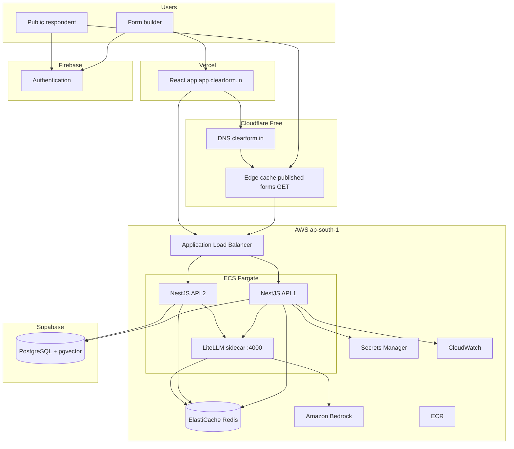
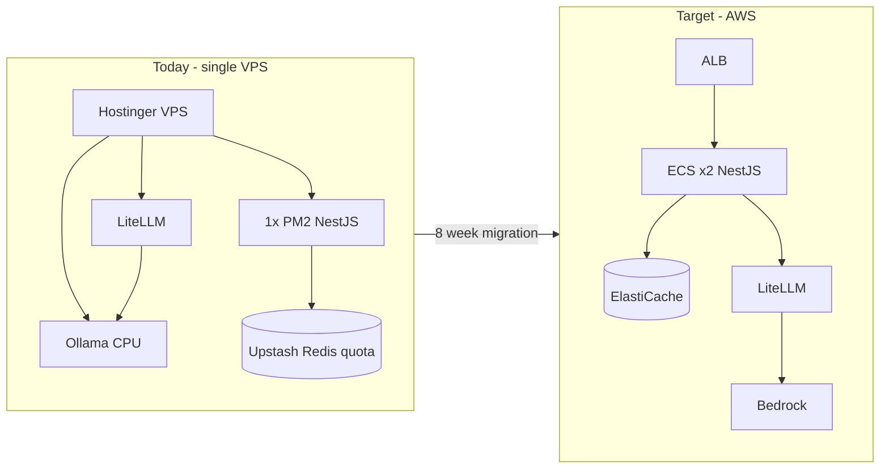
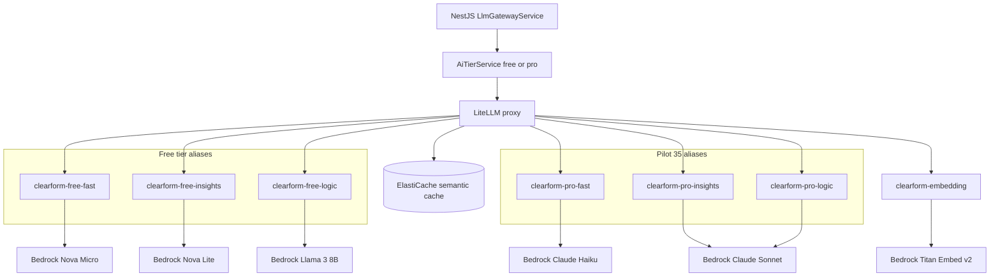
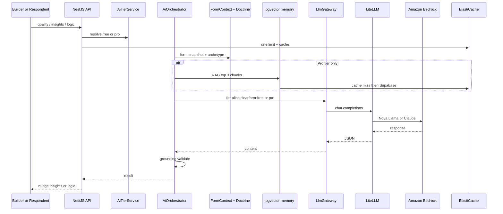

# AWS Infrastructure Request — Clearform (Incubator / AWS Activate)

**From:** Rahul (Engineering) → Abbu (Founder) — review before send  
**Horizon:** Months 1–6 on AWS — single deliberate stack  
**Date:** June 2026  

---

## Message for Abbu (Rahul → Abbu)

**Subject:** AWS Activate email — full draft for your review

Hi Abbu,

I've written the incubator email below on your behalf — with the full architecture, AI routing, stack decisions, and cost numbers included. Please read it end-to-end before you send anything. This is what we're committing to for the first 3–6 months after AWS credits.

**What I need from you:**
1. Confirm the **$10k ask** ($5k floor) matches what the incubator expects  
2. Replace `[Name]` and both email addresses in the sign-off  
3. If the tone or any number feels off for your relationship with them, tell me and I'll adjust  

The backend is already built for this — `AiTierService`, `LlmGatewayService`, and LiteLLM tier aliases are in production. On AWS we only swap `litellm.config.yaml` to Bedrock model IDs. No NestJS rewrite.

— Rahul

---

## Incubator email (Abbu → copy below this line)

**Subject:** Clearform — AWS Activate credits ($10k) · backend + AI on Bedrock

Hi [Name],

I'm Abbu, founder of **Clearform** ([app.clearform.in](https://app.clearform.in) · [api.clearform.in](https://api.clearform.in)) — an AI-native form builder, live in production.

We are requesting **$10,000 in AWS Activate credits** to migrate our backend off a single VPS onto AWS and run **all AI through one gateway: LiteLLM → Amazon Bedrock**, with **free vs paid model tiers already enforced in our backend**.

---

### Why we need AWS now

Today everything runs on **one VPS**: NestJS API, Redis client, LiteLLM, and a local Ollama instance. Under load:

- One PM2 process cannot scale horizontally  
- Upstash Redis hits command quotas → BullMQ queues stall (AI insights, webhooks, quality scoring)  
- Users feel slowness on dashboard, analytics, and AI features  

We need **2+ API instances**, **managed Redis in-VPC**, and **Bedrock-backed AI** — without a risky database migration on day one.

---

### Architecture (first principles)

**One compute plane (AWS). One data plane (Supabase). One AI plane (LiteLLM → Bedrock).**

NestJS never calls Bedrock or OpenRouter directly. It calls LiteLLM aliases only (`clearform-free-*` / `clearform-pro-*`). OpenRouter is **not** a separate stack — at most optional fallback rows inside the same LiteLLM config if Bedrock throttles.

#### Diagram 1 — Target platform (months 1–6)

#### Diagram 2 — Current vs target

#### Diagram 3 — AI routing via LiteLLM

---

### What moves to AWS (~8 weeks)

| Component | AWS service | Purpose |
|-----------|-------------|---------|
| NestJS API (2 instances) | ECS Fargate + ALB | Horizontal scale, health checks, HTTPS |
| Queues, cache, AI dedup | ElastiCache Redis (`cache.t4g.small`) | BullMQ, rate limits, LiteLLM semantic cache |
| All LLM traffic | LiteLLM sidecar → **Amazon Bedrock** | Single AI gateway |
| Images & secrets | ECR, Secrets Manager | Deploy pipeline, API keys |
| Monitoring | CloudWatch | Logs, metrics (alongside Sentry) |

---

### AI routing (already in code — LiteLLM config swap on deploy)

| User tier | LiteLLM alias | Bedrock model (primary) |
|-----------|---------------|-------------------------|
| **Free** | `clearform-free-fast` | Amazon Nova Micro |
| **Free** | `clearform-free-insights` | Amazon Nova Lite |
| **Free** | `clearform-free-logic` | Meta Llama 3 8B Instruct |
| **Pilot ($35/mo)** | `clearform-pro-fast` | Claude 3 Haiku |
| **Pilot ($35/mo)** | `clearform-pro-insights` | Claude 3.5 Sonnet |
| **Pilot ($35/mo)** | `clearform-pro-logic` | Claude 3.5 Sonnet |
| **Both** | `clearform-embedding` | Amazon Titan Embed v2 |

Free users get economical Bedrock models for quality coaching and basic insights. Pilot subscribers get Claude for deep insights, logic generation, and pgvector RAG memory. Premium models are gated in `AiTierService` — not available to free users regardless of config.

We **retire Ollama on CPU** on migration. Bedrock is faster, more reliable, and billable through the same AWS account as credits.

---

### Stack for months 1–6 (only these)

| We use | Role |
|--------|------|
| **AWS** — ECS, ALB, ElastiCache, Bedrock, LiteLLM, ECR, Secrets Manager, CloudWatch | Compute, cache, AI |
| **Supabase** | PostgreSQL + pgvector (`form_memory_chunks`) |
| **Vercel** | React frontend (`app.clearform.in`) |
| **Cloudflare** | DNS + edge cache for published forms |
| **Firebase** | Authentication |

| We retire | Why |
|-----------|-----|
| Hostinger VPS | Replaced by ECS |
| Ollama (local LLM) | Replaced by Bedrock |
| Upstash Redis | Replaced by ElastiCache |

We are **not** migrating Postgres to RDS, frontend to AWS, or auth off Firebase in this phase. That is intentional — lower risk, faster migration, credits focused on what fixes performance.

---

### Monthly run-rate (after credits expire)

| Line item | Min | Max |
|-----------|-----|-----|
| AWS — ECS + ALB + ElastiCache + misc | $130 | $180 |
| AWS — Bedrock (usage-based) | $50 | $270 |
| **AWS subtotal** | **$180** | **$450** |
| Supabase Pro | $25 | $75 |
| Vercel / Cloudflare / Firebase | $0 | $20 |
| **Platform total** | **~$205/mo** | **~$545/mo** |

Bedrock is the variable line. Free-tier traffic uses Nova/Llama; Claude usage is limited to paying Pilot users. LiteLLM Redis semantic cache and tier rate limits keep spend bounded.

At ~20k users in the ecosystem (2–5k active creators), **$10k credits covers infra + Bedrock for approximately 6 months**.

---

### Credits ask

| Tier | Amount | Covers |
|------|--------|--------|
| **Ask** | **$10,000** | ECS + ElastiCache + ALB + Bedrock for ~6 months |
| **Minimum acceptable** | **$5,000** | Core infra; Bedrock on economical models early |

Credits should cover **AWS compute, cache, load balancing, and Bedrock** — not Supabase or Vercel (paid separately, already in place).

---

### What users will notice after migration

- Faster dashboard and analytics (2 API instances, Redis in-VPC)  
- Reliable AI insights and webhooks (queues no longer stall on Redis quota)  
- Public forms stay fast (Cloudflare already caches published endpoints)  
- Pilot users get consistently better AI (Claude on Bedrock vs CPU Ollama today)

---

Happy to share architecture diagrams or do a 30-minute technical walkthrough.

Thank you,  
**Abbu**  
Founder, Clearform  
[your email] · Engineering: Rahul [your email]  
Health: `GET https://api.clearform.in/api/v1/health`

---

## Internal reference (not for incubator)

### Diagram 4 — AI request pipeline (inside NestJS)

### Migration order

1. VPC, ECR, ElastiCache, Secrets Manager  
2. ECS + ALB; Cloudflare → ALB for `api.clearform.in`  
3. LiteLLM sidecar with Bedrock config; disable Ollama  
4. BullMQ on ElastiCache; cut Upstash  
5. Bedrock Titan embeddings for pgvector  
6. Decommission VPS  

### Code already shipped

- `AiTierService` — free vs Pilot $35  
- `LlmGatewayService` — tier → LiteLLM aliases only  
- `AiOrchestratorService` — doctrine, grounding, Pro-only RAG  
- `litellm.config.yaml` — tier aliases + Redis semantic cache  

### Credits math (6 months)

| Item | ~$/month | 6 months |
|------|----------|----------|
| ECS + ALB + ElastiCache + misc | $130–180 | $780–1,080 |
| Bedrock | $50–270 | $300–1,620 |
| **Total AWS** | **$180–450** | **$1,080–2,700** |
