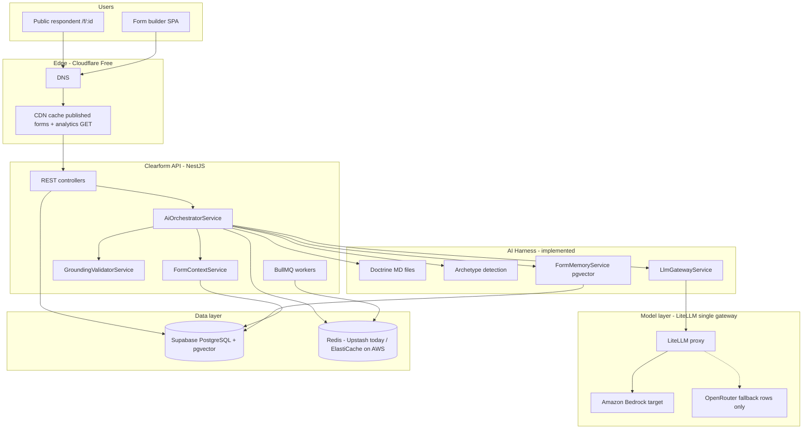
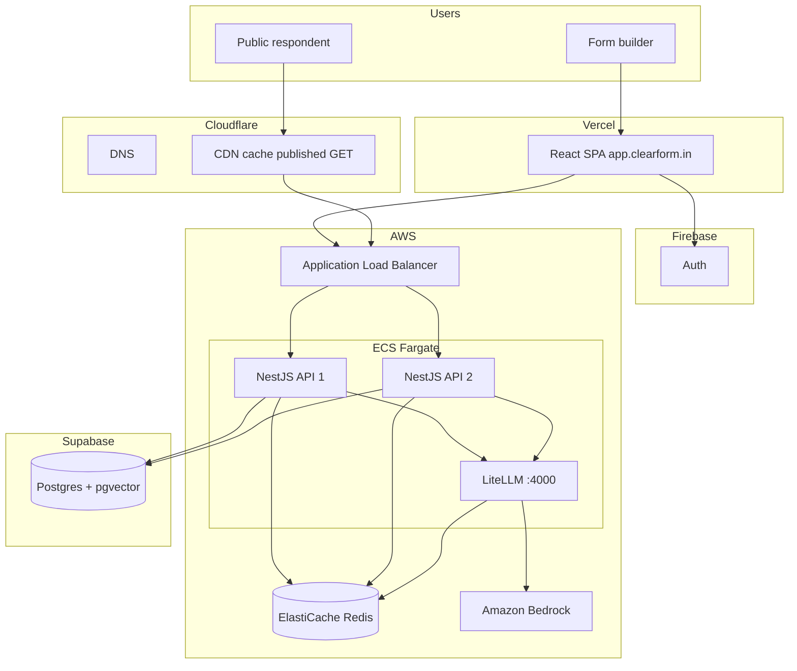
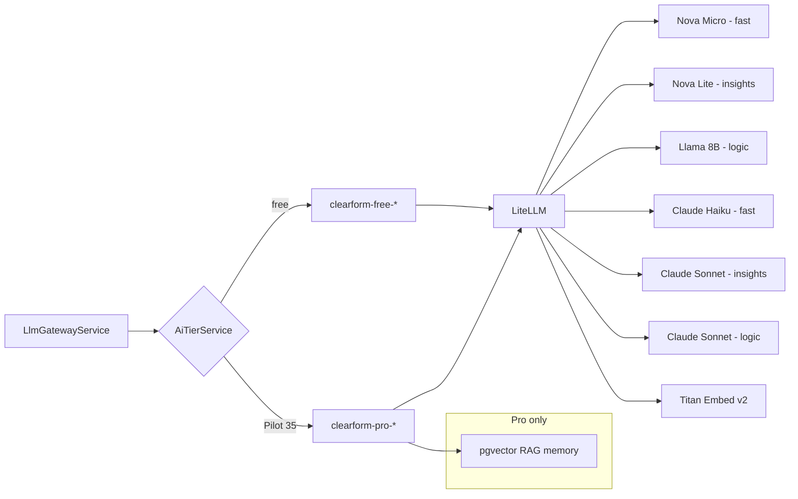
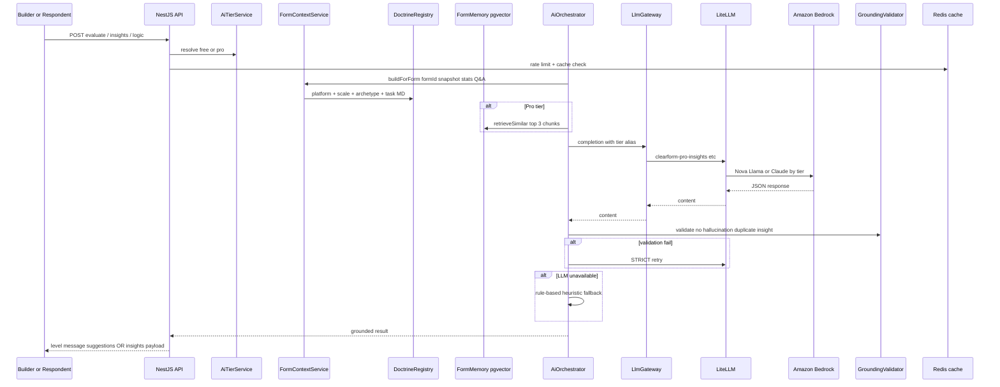

# Clearform AI Platform — Confidential Technical Brief

**Classification:** Internal / Founder & investor conversations only  
**Version:** 1.0 · June 2026  
**Audience:** Abbu (Founder), Rahul (Engineering), incubator / AWS partners under NDA  

---

## 1. Executive summary — our USP

Most form builders treat AI as a bolt-on: a single prompt, generic copy, no grounding, no memory of the form’s purpose. **Clearform’s USP is a metacognitive AI harness** — AI that understands *why* a form exists, *what* each question is trying to learn, and *how* real respondents behave — then delivers:

| Capability | What users get | Why it matters |
|------------|----------------|----------------|
| **Response quality (live)** | Context-aware nudges while typing — references the actual question, not generic “write more” | Higher completion + richer data for surveys, NPS, research, club signups |
| **AI logic generation** | Branching rules from form structure + archetype (NPS, academic, founder discovery) | Non-technical builders get smart flows without learning logic syntax |
| **AI insights & overview** | Themes from **real answer text**, distinct summary vs priority, drop-off tied to question labels | Analytics that feel like a researcher, not a dashboard template |
| **Tier-aware AI** | Free: fast heuristics + small models; Pilot ($35): premium models + RAG memory + higher limits | Monetization aligned with value — paying users get measurably better output |
| **Per-form memory (pgvector)** | Past quality feedback, insight themes, logic patterns scoped to each form | AI improves on repeat use without leaking data across forms |

**One-line pitch:** *Clearform is the form platform where AI understands your form’s intent and your respondents’ answers — not just your settings screen.*

---

## 2. Big-picture architecture

### 2b. Target deployment architecture (AWS — months 1–6)

### 2c. Free vs Pro model routing (Bedrock via LiteLLM)

---

## 3. How a single AI request flows

Every AI feature (quality, logic, insights, overview) follows the **same pipeline** — no ad-hoc prompts in controllers.

---

## 4. What we use and why

| Component | Technology | Why |
|-----------|------------|-----|
| **Orchestrator** | `AiOrchestratorService` | Single front door — consistent degradation, caching, tier routing |
| **Doctrine** | Markdown files in `src/ai/doctrine/` | Product rules ship with the AI module — versioned, auditable |
| **FormContext** | Postgres snapshot + responses | AI sees question labels, quality options, completion stats, Q&A excerpt |
| **Archetypes** | Heuristic + MD (NPS, academic, club, founder, internal review) | Steers tone and insights without exposing “we think your motive is X” to the builder |
| **Grounding** | `GroundingValidatorService` | Rejects fake NPS, duplicate summary/priority, invalid screen IDs |
| **Memory** | `form_memory_chunks` + pgvector on Supabase | Per-form RAG — quality feedback, insight themes, logic patterns |
| **Model routing** | LiteLLM → Amazon Bedrock (OpenRouter fallback rows only) | One API surface; swap models in config without redeploying NestJS |
| **Queues** | BullMQ on Redis | Async quality scoring, insights jobs, webhooks, response side-effects |
| **Tiers** | `AiTierService` + `PILOT_35_PLAN` | Free vs Pro model aliases and rate limits |

---

## 5. AI product surfaces (live endpoints)

| Endpoint | User sees | AI input |
|----------|-----------|----------|
| `POST .../response-quality/evaluate` | Green/amber/red + suggestion while typing | questionText, answerText, criteria, form purpose, archetype |
| `POST .../logic/generate` | Branching graph on Logic tab | All content screens + doctrine + optional RAG |
| `POST .../analytics/.../ai-insights` | Summary, priority, patterns, sentiment | Q&A pairs + drop-off + stats |
| `GET .../analytics/.../overview` | KPI banner + “Improve with AI” | Worst drop-off step + LLM one-liner |

---

## 6. Free vs Pro AI (monetization harness)

| Dimension | Free | Pro (Pilot $35/mo) |
|-----------|------|---------------------|
| Models | `clearform-free-*` (3B free / Ollama) | `clearform-pro-*` (Claude Haiku/Sonnet, GPT-4o-mini, Gemini Flash) |
| RAG memory | Skipped (snapshot-only) | pgvector top-3 chunks |
| Rate limits | 60 quality/min, 2 insights/hr | 300 quality/min, 8 insights/hr |
| Suggestions | 1 per nudge | Up to 2 |
| Insights patterns | 25+ responses | 15+ responses, richer examples |
| Grounding retries | 1 | 2 |

Free tier **always** falls back to rule-based heuristics — never empty or “upgrade to see quality.”

---

## 7. What is implemented vs planned

### Implemented (June 2026)

- Full orchestrator pipeline with doctrine, grounding, tier service
- LiteLLM config with free/pro model aliases + Redis semantic cache config
- Unified post-submit quality scoring through orchestrator (no duplicate prompt path)
- Analytics drop-off fix, performance Redis cache, overview API + FE wiring
- Per-form Sheets (`formSpreadsheetIds`) and Slack (`formSlackChannels`) metadata
- Formatted Slack messages + email template with answer preview
- Three new archetypes: academic-research, community-club, founder-product-discovery
- Quality eval Redis dedup (30s), insights cache (24h), logic cache (7d)

### Planned (future scope)

| Phase | Item | Impact |
|-------|------|--------|
| **Q3 2026** | Migrate API compute to AWS ECS/EC2 (multi-instance) | Fixes platform slowness — today single VPS, 1 PM2 process, 512MB cap |
| **Q3 2026** | ElastiCache Redis replaces Upstash | No command quota; sub-ms cache in VPC |
| **Q3 2026** | Bedrock as LiteLLM backend for Pro tier | Data residency, predictable AWS billing |
| **Q4 2026** | End-screen completion summary (quality final eval) | Respondent-facing “you’re done” coaching |
| **Q4 2026** | LiteLLM virtual keys per workspace | Hard budget caps per customer |
| **2027** | Optional RDS migration from Supabase | Only if Supabase limits pgvector scale — not required for AWS credits |
| **2027** | GPU node for self-hosted small models | Reduce OpenRouter spend at 100k+ MAU |

---

## 8. Why the platform feels slow today

Root causes on current VPS (not AI-specific):

1. **Single server, single PM2 instance** — all API + LiteLLM + Ollama on one 8GB box
2. **Upstash free tier** — 500k Redis commands/month exhausted → Bull queues stall → side effects delay
3. **PM2 log bloat** — disk fill causes I/O degradation (documented in `docs/vps-disk-and-redis.md`)
4. **No horizontal scale** — traffic spikes queue behind one Node process
5. **Ollama on CPU** — acceptable for background quality; not the main page-load bottleneck

**Highest-impact fixes (in order):** Upstash Pro → AWS compute with 2+ API instances → ElastiCache → Cloudflare cache rules (already documented).

---

## 9. Confidentiality note

This document describes proprietary architecture (doctrine harness, tier routing, grounding rules). Do not distribute outside Clearform, bound advisors, or incubator/AWS partners under NDA. Public marketing should use the one-line USP and user outcomes only — not internal pipeline diagrams.

---

*Prepared by Clearform Engineering · Questions: Rahul*
