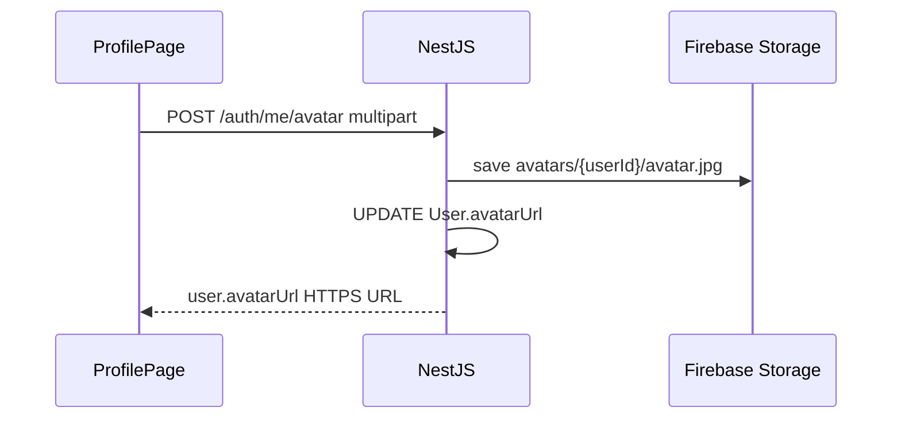

# Profile avatar storage

**Last updated:** 2026-06-27

## Overview

Profile photos are stored in **Firebase Storage** (not Supabase Storage). Supabase in this project is **Postgres only**.

## API

| Method | Path | Body | Response |
|--------|------|------|----------|
| `POST` | `/api/v1/auth/me/avatar` | `multipart/form-data` field `file` | `{ user: { avatarUrl, ... } }` |
| `PATCH` | `/api/v1/auth/me` | `{ avatarUrl: "https://..." }` | Set URL directly (HTTPS only) |
| `GET` | `/api/v1/auth/me` | — | Includes `avatarUrl` |

Limits: JPG, PNG, GIF; max 2 MB.

## Firebase console setup

1. Firebase project → **Storage** → Get started
2. Create bucket (default: `{project-id}.appspot.com`)
3. **Rules** (example — tighten for production):

```
rules_version = '2';
service firebase.storage {
  match /b/{bucket}/o {
    match /avatars/{userId}/{fileName} {
      allow read: if true;
      allow write: if request.auth != null && request.auth.uid == userId;
    }
  }
}
```

Server uploads use Admin SDK (bypasses client rules). Ensure the service account has **Storage Admin** or object create permission on the bucket.

## Env vars

**Backend** (`.env` on VPS):

```
FIREBASE_STORAGE_BUCKET=your-project.appspot.com
FIREBASE_CREDENTIALS_PATH=./service-account.json
```

**Frontend** (Vercel):

```
VITE_FIREBASE_STORAGE_BUCKET=your-project.appspot.com
```

## Upload sequence



## Smoke test

```bash
curl -sS -X POST https://api.clearform.in/api/v1/auth/me/avatar \
  -H "Authorization: Bearer $TOKEN" \
  -F "file=@avatar.jpg"

curl -sS https://api.clearform.in/api/v1/auth/me \
  -H "Authorization: Bearer $TOKEN"
```

## Migration

```bash
npx prisma migrate deploy
```

Migration: `20260627120000_user_avatar_url` adds `User.avatarUrl`.
